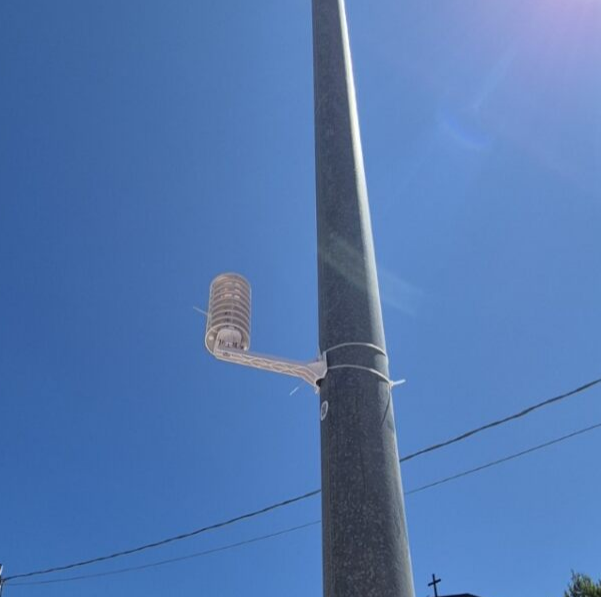

# Benvenuti al sito di UHBiofeat
## sito per la rete di sensori di appoggio 
Il progetto di Monitoraggio delle Isole di Calore Urbano (Urban Heat Island) valutando il contributo del verde urbano tenendo conto della connetività con la biodiversità extra urbana

  

